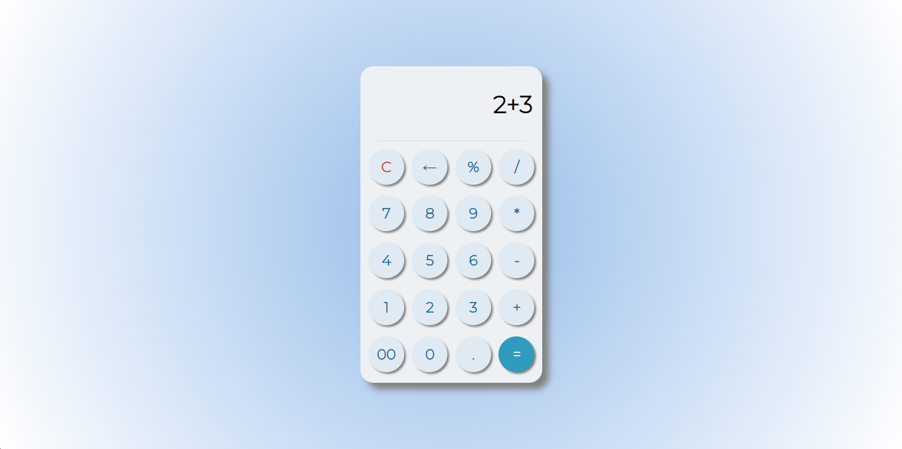

# Simple Calculator

This is a simple calculator application built using HTML, CSS, and JavaScript. The calculator supports basic arithmetic operations such as addition, subtraction, multiplication, and division.

## Table of Contents

- [Features](#features)
- [Installation](#installation)
- [Usage](#usage)
- [Screenshots](#screenshots)
- [Contributing](#contributing)
- [License](#license)

## Features

- Basic arithmetic operations: addition, subtraction, multiplication, and division.
- Responsive design for different screen sizes.
- Clear button to reset the calculator.
- Intuitive user interface.

## Installation

1. Clone the repository:
    ```bash
    git clone https://github.com/YashS-2519/Calculator.git
    ```

2. Navigate to the project directory:
    ```bash
    cd Calculator
    ```

3. Open `index.html` in your browser to use the calculator.

## Usage

1. Open the `index.html` file in a web browser.
2. Use the calculator by clicking the buttons to input numbers and operators.
3. Click the "=" button to see the result.
4. Click the "C" button to clear the input and start a new calculation.

## Screenshots



## Contributing

Contributions are welcome! Please follow these steps:

1. Fork the repository.
2. Create a new branch (`git checkout -b feature-branch`).
3. Make your changes.
4. Commit your changes (`git commit -m 'Add some feature'`).
5. Push to the branch (`git push origin feature-branch`).
6. Open a pull request.

## License

This project is licensed under the MIT License - see the [LICENSE](LICENSE) file for details.
